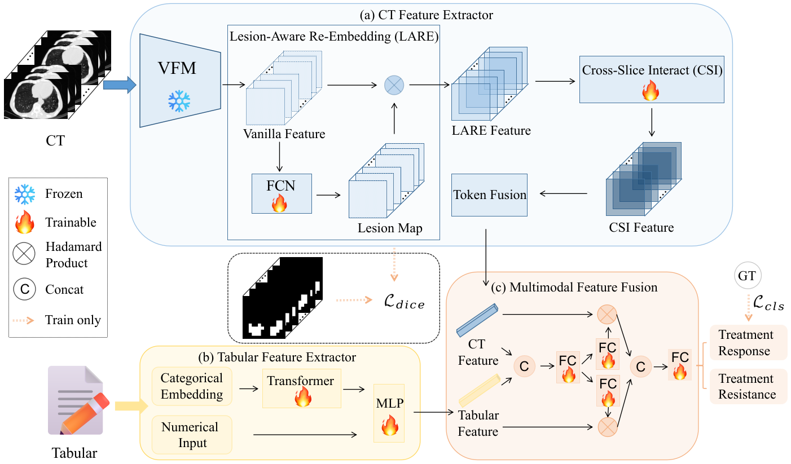

# PTRNet
## A Novel Multimodal Learning Method for Prediction of Treatment Resistance in MPO-AAV

[[`Model`](#wait)] [[`Paper`](#wait)] [[`BibTeX`](#wait)]

## Method Overview

<p align="center">
     <br>
</p>

## Install

1. Download the repository and open the PTRNet
```
git clone https://github.com/yinangit/PTRNet.git
cd PTRNet
```

2. Required requirements

```bash
cd env
conda env create -f environment.yml
cd tab-transformer-pytorch
pip install -e .
```

3. Optional requirements (for feature extraction)

```bash
cd env/CLIP
pip install -e .
cd ../lungmask
pip install -e .
cd ../timm-0.9.12
pip install -e .
```

## Run

- **Train**
```bash 
python scripts/train_modality_ablation.py --saveName modality_ablation --model_mode union --d_model 256
```

- **Test**
```bash 
python scripts/test.py --saveName modality_ablation --model_mode union --d_model 256 --weight_path log/modality_ablation/model_final.pt
```

- **Ablation**

Taking `ablation of hyperparameter γ` as an example:
```bash 
cd launch
bash ablation_gamma.sh
```

## Acknowledgements


## Citation
